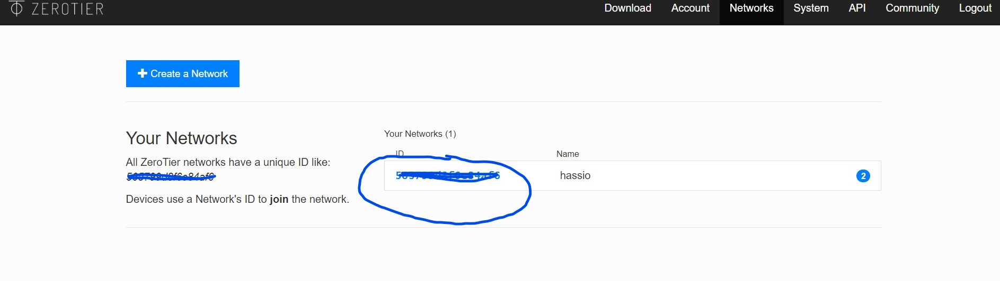
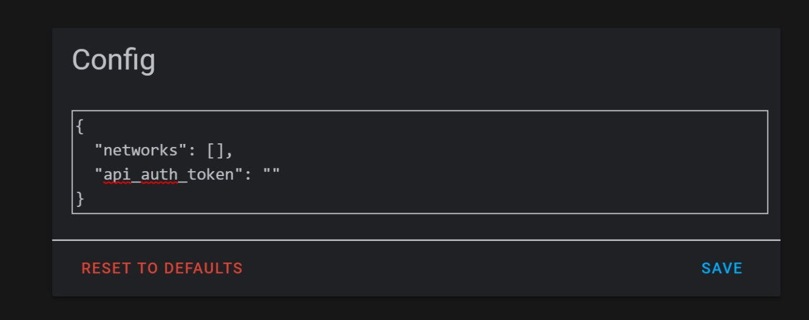
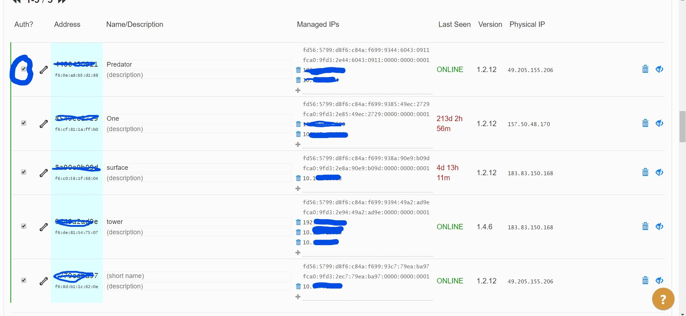

Different ways to acess Home Assistant from outside Network 

1. Paying Nabucasa , will cost about Rs.350 per month , this will enable to acess your instance through their server , this also lets you to add your devices to Alexa or Google Home easily 

2. Using Zero tire one
   
    Create a free acount in zerotire one website
    Log in and got to Networks tab and create a new network and notedown your Network Id
    
    
    
    If using Hassio install zerotire addon and enter your network id in the addon configuration page
    
    
    
    For users in docker install zerotire in docker and configure your network ID
    
    Install zerotire app in your mobile or Pc or Mac and enter the same network Id 
    
    Next login to your zerotire website -> networks tab -> click on your network ID.
    scroll down and check the auth? check box for the devices to communicate with each other
    You can see the assigned Ip adress to the right (check image), and use the same Ip adress to acess tour Ha instance 
    For eg: http://10.x.x.x:8123
    
    
    
    
