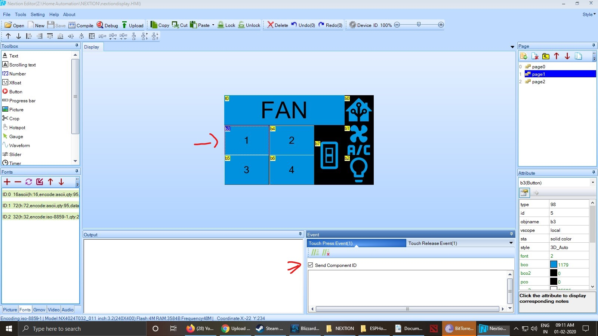

1. Page Navigation is done through the HMI File(see pic)

2. We have to define each and every button in ESPHome , either button press event or button release event as a binary sensor.Send component ID checkbox has to be checked to work.

